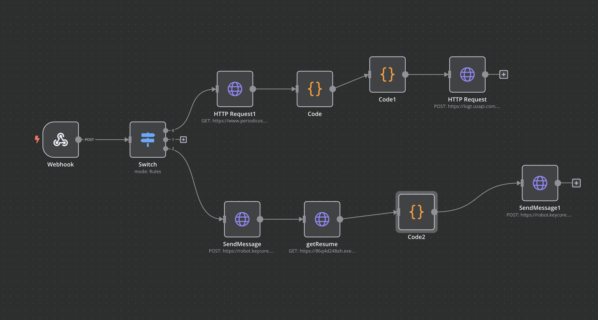

# SciFlow: Acesso Simples a Artigos Acadêmicos via WhatsApp

## Descrição

O **SciFlow** é uma solução inovadora que facilita o acesso a conteúdos acadêmicos de forma simples e intuitiva. Integrando APIs, tecnologia de comunicação e inteligência artificial, proporcionamos resumos de artigos acadêmicos diretamente pelo WhatsApp, eliminando barreiras de navegação em plataformas acadêmicas complexas.

---

## Arquitetura do Projeto

O projeto utiliza uma arquitetura baseada em serviços da AWS e ferramentas modernas para garantir escalabilidade, eficiência e acessibilidade:

1. **API Gateway**: Disponibiliza uma API REST para receber solicitações.
2. **AWS Lambda**: Realiza o processamento principal, incluindo:
   - **Crawler** no portal de periódicos para extrair informações.
   - Integração com a API da OpenAI para resumir os artigos.
3. **AWS EC2 com n8n**: Automação de comunicação, conectando:
   - WhatsApp para interagir com os usuários.
   - API Gateway para processar os temas enviados.

---

## Arquitetura Visual



---

## Como Usar

### Passo 1: Enviar uma Mensagem
Envie uma mensagem para o número do WhatsApp:  
📱 **+55 88 99929-7262**

### Passo 2: Escolha o Tema
Digite o tema de um artigo que deseja pesquisar. Exemplos:
- **Saúde mental**
- **Internet das coisas**
- **Sustentabilidade**

### Passo 3: Receba o Resumo
A solução buscará artigos relevantes, resumirá o conteúdo e retornará diretamente pelo WhatsApp.

---

## Tecnologias Utilizadas

- **AWS API Gateway**: Disponibiliza a API REST.
- **AWS Lambda**: Executa o crawler e integra com a API da OpenAI.
- **AWS EC2**: Hospeda o n8n para gerenciar a comunicação.
- **WhatsApp API**: Interface para interação com os usuários.
- **OpenAI GPT-4**: Gera resumos simplificados dos artigos.
---

## Tabela de Preços do GPT-4o-mini

O custo por token no modelo **GPT-4o-mini** é bastante acessível, tornando-o ideal para operações em larga escala. Confira a tabela de preços:

| **Tipo de Solicitação**           | **Preço por 1.000 tokens (USD)** |
|-----------------------------------|----------------------------------|
| Entrada + Saída (Combined)        | $0.0015                         |

> **Nota**:  
> - Tokens incluem palavras do prompt (entrada) e da resposta (saída).  
> - Aproximadamente, 1.000 tokens correspondem a 750 palavras.

---

## Simulação de Solicitação

### Suposições
1. **Tokens de Entrada (Prompt)**: 200 tokens  
   - Exemplo: O texto enviado para análise, como o resumo do artigo.
2. **Tokens de Saída (Resposta)**: 150 tokens  
   - Exemplo: Resumo gerado pela API OpenAI.

**Total de Tokens por Solicitação**:  
200 (entrada) + 150 (saída) = **350 tokens por solicitação**.

---

### Cálculo do Custo por Solicitação

- **Custo por 1.000 tokens**: $0.0015  
- **Custo por 350 tokens**:  
  \[
  350 \, \text{tokens} \times \frac{\$0.0015}{1000} = \$0.000525
  \]

---

### Quantidade de Solicitações com $5

Com um saldo de **$5**, o número de solicitações possíveis é:
\[
\frac{5}{0.000525} \approx 9.523 \, \text{solicitações}
\]

Arredondando para baixo, é possível realizar **9.523 solicitações** com $5.

---

## Simulação de Requisição e Resposta


### Requisição (GET)
https://86q4d248ah.execute-api.us-east-2.amazonaws.com/dev/resume?q=saude%20mental

---

## Simulação de Requisição e Resposta
### Resposta (JSON)
```json
[
  {
    "titulo": "Políticas culturais e saúde mental na infância: políticas públicas de cultura e sua importância para o desenvolvimento da saúde mental das crianças",
    "link": "https://www.periodicos.capes.gov.br/index.php/acervo/buscador.html?task=detalhes&source=&id=W4395690089",
    "publicacao": "Artigo",
    "titulo_completo": "Políticas culturais e saúde mental na infância: políticas públicas de cultura e sua importância para o desenvolvimento da saúde mental das crianças",
    "ano": "2024",
    "instituicao": "Servicios Academicos Intercontinentales",
    "volume": "Volume: 16",
    "issue": "Issue: 4",
    "linguagem": "Linguagem: Português",
    "doi": "10.55905/cuadv16n4-136",
    "issn": "1989-4155",
    "autores": "Antônio Nacílio Sousa dos Santos, Francisco de Assis de Araújo Júnior, Carlos Augusto Marinho de Sousa, Carlos Rigor Neves, José Maria Nogueira Neto",
    "resumo": "São vários os aspectos que impactam positivamente no desenvolvimento da saúde mental de uma criança, dentre os quais se destacam as políticas públicas culturais...",
    "resumo_ia": "O artigo destaca a importância das políticas públicas culturais para a saúde mental das crianças..."
  }
]
```

### Conclusão

Com um saldo de $5, é possível realizar cerca de 9.523 solicitações ao modelo GPT-4o-mini, considerando um tamanho médio de entrada de 200 tokens e saída de 150 tokens por solicitação.

Essa abordagem garante que o modelo seja uma solução altamente econômica para gerar resumos e análises de texto com alta qualidade e escalabilidade.


---

## Contato

Caso tenha dúvidas ou queira saber mais sobre o projeto, entre em contato pelo número 📱 **+55 88 99929-7262** ou envie um e-mail para [contato@sciflow.com](mailto:contato@sciflow.com).


# TESTE de maneira simples!!

